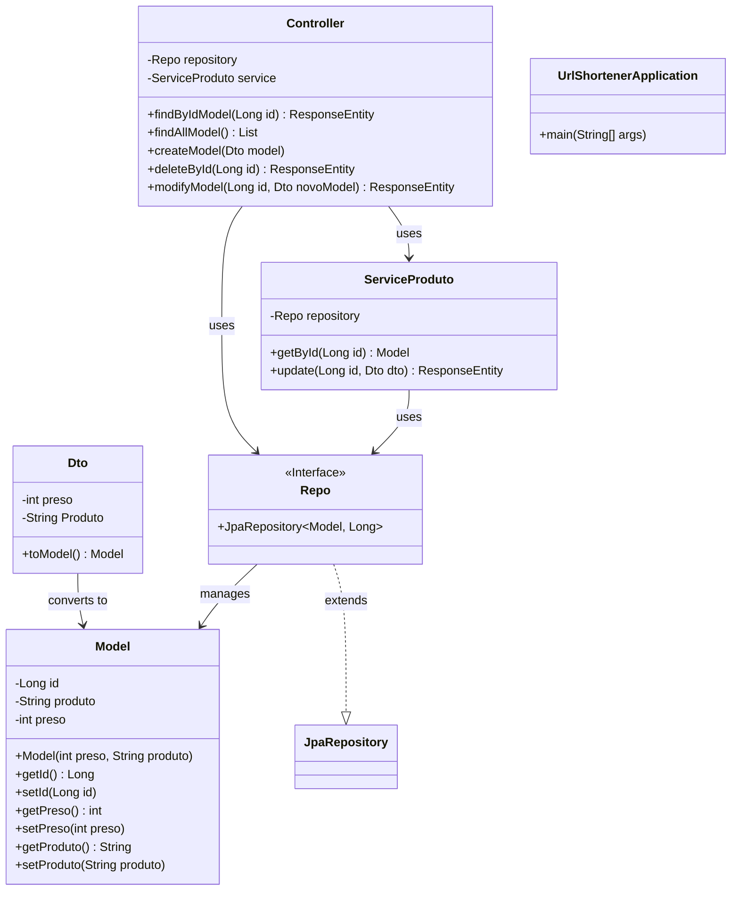

# URL Shortener

This project is a URL shortener developed in Java using the Spring Boot framework. It allows you to create short URLs that redirect to long URLs, making link sharing and management easier.

## Project Structure

```
urlShortener/
├── mvnw*
├── pom.xml
├── src/
│   ├── main/
│   │   ├── java/com/luis/urlShortener/
│   │   │   ├── UrlShortenerApplication.java
│   │   │   ├── controller/Controller.java
│   │   │   ├── dto/Dto.java
│   │   │   ├── model/Model.java
│   │   │   ├── reposiroty/Repository.java
│   │   │   └── Service/ServiceProduto.java
│   │   └── resources/
│   │       ├── application.properties
│   │       ├── static/
│   │       └── templates/
│   └── test/java/com/luis/urlShortener/UrlShortenerApplicationTests.java
└── target/
```

## Main Components

- **Controller**: Responsible for receiving HTTP requests and directing them to the appropriate service.
- **ServiceProduto**: Contains the business logic for shortening URLs and redirecting.
- **Repository**: Interface for persisting URL data.
- **Model**: Represents the URL entity in the system.
- **Dto**: Data transfer object between layers.

## How It Works

1. The user sends a long URL to the system.
2. The system generates a short URL and stores the mapping in the database.
3. When accessing the short URL, the system redirects to the original URL.

## UML Diagram (Mermaid)



## How to Run

1. Make sure you have Java 17+ and Maven installed.
2. Clone the repository and navigate to the project folder.
3. Run the command:
   ```
   ./mvnw spring-boot:run
   ```
4. Access `http://localhost:8080` to use the URL shortener.

## Tests

Tests are located at `src/test/java/com/luis/urlShortener/UrlShortenerApplicationTests.java`.

Run:
```
./mvnw test
```

## Configuration

Project settings are in `src/main/resources/application.properties`.

---

Developed by Luis.
