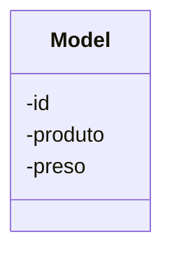
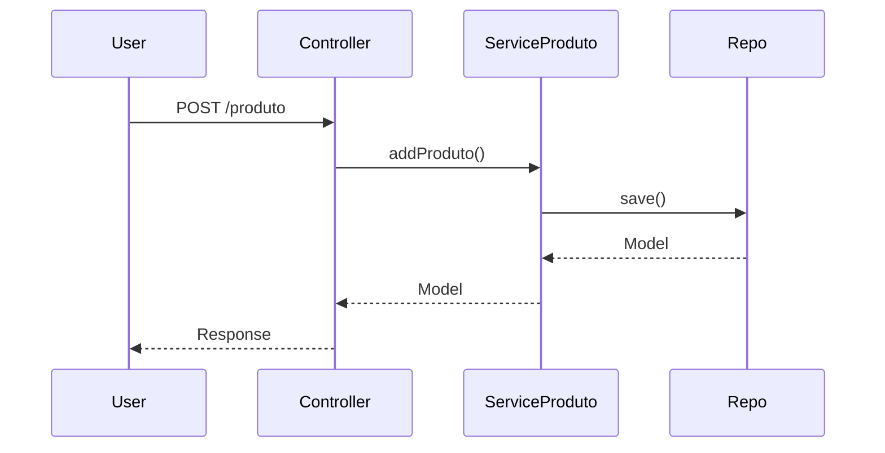

# Mermaid Examples

## Class Diagram

```mermaid
classDiagram
    class Model {
        -id
        -produto
        -preso
    }
```

## Sequence Diagram

```mermaid
sequenceDiagram
    participant User
    participant Controller
    participant ServiceProduto
    participant Repo
    User->>Controller: POST /produto
    Controller->>ServiceProduto: addProduto()
    ServiceProduto->>Repo: save()
    Repo-->>ServiceProduto: Model
    ServiceProduto-->>Controller: Model
    Controller-->>User: Response
```
