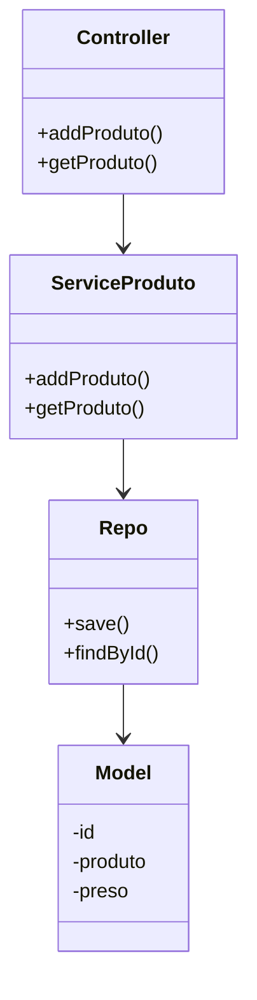

# UML Diagram (Mermaid)

```mermaid
classDiagram
    class Controller {
        +addProduto()
        +getProduto()
    }
    class ServiceProduto {
        +addProduto()
        +getProduto()
    }
    class Repo {
        +save()
        +findById()
    }
    class Model {
        -id
        -produto
        -preso
    }
    Controller --> ServiceProduto
    ServiceProduto --> Repo
    Repo --> Model
```
